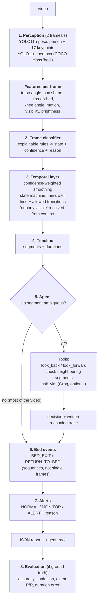

# Elderly Bed-Activity Monitor

An agentic computer-vision system that watches an indoor bedroom video of an elderly person and reports:

1. **what the person was doing over time** (a state timeline),
2. **when they left the bed and when they came back** (bed-exit / return events),
3. **how long each activity lasted** (duration summary),
4. **whether anything needs attention** (`NORMAL` / `MONITOR` / `ALERT`, with the reason).

It runs on a **laptop CPU**, uses **only free tools**, and works **without an API key**. An optional free vision-language model (Groq) is called only for the few moments the system is genuinely unsure about.

```
python -m src.run path\to\any_video.mp4
```

---

## Results at a glance

Evaluated on 4 test videos (14.4 minutes, 1,792 analysed frames) built from real footage, with frame-accurate ground truth.

| Metric | Frame-by-frame rules | + temporal logic | **+ agent (final)** |
|---|---|---|---|
| State accuracy | 76.1% | 84.4% | **86.1%** |
| Bed-exit precision / recall | | 0.33 / 0.33 | **1.00 / 1.00** |
| Return-to-bed precision / recall | | 1.00 / 1.00 | **1.00 / 1.00** |
| False bed exits | | 2 | **0** |
| Bed-exit timing error | | 10.1 s | **0.8 to 2.4 s** |

Mean absolute duration error: **lying 0.3 s**, **sitting on bed 2.3 s**, **unknown 0.4 s**. Standing and walking are weaker (about 30 s) because of one known failure (walking toward the camera, see [Failure cases](#failure-cases)). Both are "out of bed", so the bed events and alerts are not affected.

The key trap in the assignment, *"sitting on the edge of the bed for a long time but not leaving"*, gives **0 false bed exits** and a correct `MONITOR` decision.

The numbers above come from the agent in **context-only mode** (no API key), so anyone can reproduce them exactly.

---

## Architecture



(Static image of the same diagram: [`docs/architecture.png`](docs/architecture.png).)

| Stage | File | Idea in one line |
|---|---|---|
| Perception | `src/perception.py` | Existing pretrained models turn pixels into a few meaningful numbers. |
| Classifier | `src/classifier.py` | A small decision tree on those numbers, with a confidence and a human-readable reason. |
| Temporal layer | `src/temporal.py` | People don't teleport: smooth over time and only allow physically possible transitions. |
| Timeline | `src/timeline.py` | Runs of equal states become segments; durations add up to the video length. |
| Agent | `src/agent.py` | Reviews only the ambiguous segments, gathers more context with tools, explains itself. |
| Events | `src/events.py` | Bed exit = in-bed, then out-of-bed that *persists*; sitting up can never count. |
| Alerts | `src/alerts.py` | A handful of rules, each with a caregiver-level justification. |
| Evaluation | `src/evaluate.py` | Compares everything with ground truth. |
| Settings | `src/config.py` | Every threshold in one place, with the measurement it was based on. |

### Why this design

* **Rules on pose features instead of training a classifier.** No labelled training data exists for this task, and the brief says training is not required. Every decision can be explained ("hips on bed, torso 78° from vertical") and changed in one line of `config.py`.
* **Thresholds come from data, not guesses.** `check_features.py` prints the median feature value per true state. For example, torso angle is ~78° when lying and ~10° when sitting, so the threshold is 50°.
* **Time is a first-class signal.** The brief asks to *understand transitions rather than classify every frame independently*. The temporal layer alone raises accuracy on **every** test video (overall 76.1% → 84.4%).
* **The expensive model is used sparingly.** The VLM is not run on every frame (that would be slow, costly and hard to evaluate). The agent calls it only for 0 to 4 ambiguous segments per video.
* **UNKNOWN is a valid answer.** Blackout, heavy occlusion and "nobody visible without explanation" give `UNKNOWN`, never a forced guess.
* **Runs anywhere.** CPU only, about 1 minute of processing per 3 minutes of video at 2 analysed frames per second. Uses no pandas or extra SDKs: the Groq call is a plain HTTPS request.

---

## Dataset

No test video was provided, so I built a test set with **exact ground truth**.

1. **Real footage.** Six free stock clips from Pexels (same elderly man, same bedroom, 12 to 30 s each): waking up, sitting up and stretching, walking in and sitting down to read, making the bed, getting into bed and lying down. They were downscaled from 4K to 720p (`prepare_clips.py`), because YOLO works at about 640 px anyway.
2. **Frame-level labels.** Each clip was labelled with a small keyboard tool (`label_tool.py`) and checked frame by frame. One consistent rule handles in-between moments: *"on the bed" starts when the person's weight is on the mattress (hips or knees)*.
3. **Long scripted sequences.** `build_sequences.py` stitches the clips into four 3 to 4 minute stories, using three tricks:
   * **ping-pong looping** turns 6 s of sleep into 60 s of sleep,
   * **reversal** turns "standing up" into a realistic "sitting back down" (the *stands briefly, sits back* case),
   * **degradations** add night-time darkness with sensor noise, an occluding object, and a camera blackout.

   Every output frame remembers which clip and second it came from, so **ground truth is generated automatically and exactly**. Occluded and blacked-out frames are labelled `UNKNOWN`, which is what the brief asks the system to answer there.

| Video | Story | Tests |
|---|---|---|
| `seq1_exit_and_return` (3.0 min) | sleeps, wakes, sits up, leaves, stands around, returns, lies down | 1 exit + 1 return |
| `seq2_no_exit_long_edge_sit` (4.2 min) | sits on the bed for ~3 min, never leaves | **no false exit**, MONITOR for long sitting |
| `seq3_brief_stand_then_exit` (4.2 min) | stands up briefly and sits back, later leaves for 2.5 min | brief stand is not an exit; prolonged absence → ALERT |
| `seq4_hard_conditions` (3.0 min) | seq1's story at night, with a 6 s occlusion and a 4 s blackout | darkness, occlusion, UNKNOWN |

**Limitations of this data (stated honestly):** one person and one room; some clips use a handheld/moving camera instead of a fixed CCTV view; clip joins are abrupt; there's no real chair, caregiver or person leaving the room on camera. The code supports those cases (see the coverage table below), but they aren't measured.

---

## How it works

### States

`LYING_IN_BED`, `SITTING_ON_BED`, `SITTING_OUTSIDE_BED`, `STANDING`, `WALKING`, `OUT_OF_BED` (left the camera view), `UNKNOWN`.

### 1. Frame classifier (`src/classifier.py`)

```
blackout?                          -> UNKNOWN
nobody detected?                   -> NO_PERSON (resolved later from context)
fewer than 25% keypoints visible?  -> UNKNOWN
hips inside bed box:
    torso > 50 deg from vertical   -> LYING_IN_BED
    shoulders hidden, wide box     -> LYING_IN_BED  (under the blanket)
    straight legs, tall box        -> STANDING      (beside the bed)
    otherwise                      -> SITTING_ON_BED
hips outside bed box:
    horizontal body                -> UNKNOWN + possible_fall
    bent knees, not moving         -> SITTING_OUTSIDE_BED
    moving                         -> WALKING
    otherwise                      -> STANDING
```

Confidence drops in low light, for in-between postures, and when few keypoints are visible.

**A rule tested and rejected with data:** "a large fraction of the body above the bed line means standing". It fixed 14 standing frames but broke 33 sitting frames, so it was not used. Those frames are flagged `ambiguous_sit_or_stand` for the agent instead.

### 2. Temporal layer (`src/temporal.py`)

* **Smoothing:** each frame's state is decided by a confidence-weighted vote over a 2.5 s window. This is centred, which suits recorded video; a live camera would add about 1 s of delay.
* **State machine:**
  * a new state must last **1.5 s** to be accepted, which removes flicker;
  * only **physically possible transitions** are accepted. `LYING → WALKING` needs sitting and standing first, so an "impossible" jump needs 3 s of evidence and is flagged for review;
  * accepted changes are **back-dated** to where they really started, so durations are not delayed.
* **"Nobody visible" is resolved from context:**
  * the person was in bed and the bed is still visible → still in bed, under the blanket (for at most 60 s);
  * the person was last seen at the frame edge while standing or walking → `OUT_OF_BED`;
  * otherwise → `UNKNOWN`.

### 3. Agent (`src/agent.py`)

The agent decides **when** an observation needs more context, then gathers it.

| Trigger | Example |
|---|---|
| `short_ambiguous_in_bed` | 1 to 5 s of "sitting on bed" with low confidence (2-D box overlap) |
| `unknown` | the state could not be determined |
| `possible_fall` | horizontal body outside the bed region |
| `implausible_transition` | the state machine accepted an unlikely jump |

**Tools:** `look_back(10 s)`, `look_forward(10 s)`, a check of the neighbouring segments, and `ask_vlm(frames)`. The last one sends up to 3 frames to **Groq `qwen/qwen3.8-27b`** with a multiple-choice question (A lying on bed, B sitting on bed, C standing/walking or bending over the bed, D sitting elsewhere, E cannot tell, F lying on the floor) and requires a JSON answer.

**Decision policy:**
* The VLM must agree with ≥ 0.60 confidence. Replacing an `UNKNOWN` or clearing a fall needs ≥ 0.75.
* Without a VLM, the agent uses temporal context only, and it **never invents evidence**: an `UNKNOWN` stays `UNKNOWN`.
* For `possible_fall` without a VLM it stays **safety-first**: the alert is kept, because a false alarm is better than a missed fall.
* VLM answers are cached (`outputs/agent_cache/`), so re-runs are reproducible and use no API calls.

Every review is written to `outputs/results/<video>_agent_trace.md`, in the format the brief uses:

```
## 2. 01:36-01:38 SITTING_ON_BED (conf 0.47)  [short_ambiguous_in_bed]
Observation: SITTING_ON_BED for only 2s with low confidence; hips overlap the bed box in 2-D
Agent:       One frame cannot tell sitting on the bed from standing beside it.
Action:      Analyze previous segment   -> previous 10s: STANDING 6s, SITTING_ON_BED 4s
Action:      Analyze following segment  -> next 10s: STANDING 10s
Action:      Check neighbouring segments -> directly before: STANDING, directly after: STANDING
Action:      Compare context -> sandwiched between out-of-bed segments: a real sit-down of only
             2s is unlikely; probably standing beside the bed
Conclusion:  SITTING_ON_BED -> STANDING (decided by: context)
```

This single correction is what moves bed-exit detection from 0.33 to 1.00 precision and recall.

### 4. Bed events (`src/events.py`)

Each state belongs to a bed status: **IN** (lying, sitting on bed) or **OUT** (standing, walking, sitting elsewhere, out of view). `UNKNOWN` never changes the status.

* **BED_EXIT:** the status goes IN → OUT. It is confirmed when the person starts moving away, or has stayed out for 5 s. If they get back on the bed first, it is logged as a `brief_stand` note, **not** an exit.
* **RETURN_TO_BED:** the status goes OUT → IN. It is confirmed when the person lies down, or has stayed on the bed for 10 s.
* Sitting up and turning over are both **IN**, so they can **never** create a bed exit.
* For evaluation, **the same definition is applied to the ground-truth timeline**, so precision and recall compare like with like (match tolerance ±10 s).

### 5. Alerts (`src/alerts.py`)

| Decision | Rule | Why |
|---|---|---|
| **ALERT** | horizontal body outside the bed | a possible fall is the most dangerous situation for someone living alone |
| **ALERT** | out of bed longer than the limit | a long night-time absence may mean a fall out of view, confusion or wandering |
| MONITOR | every bed exit | most night-time falls happen shortly after getting up, but leaving the bed isn't an emergency by itself |
| MONITOR | sitting on the bed longer than the limit | often happens before an exit, or signals dizziness or difficulty standing |
| MONITOR | `UNKNOWN` longer than the limit | when the system can't see, a human should check |
| MONITOR | implausible transition | either something unusual happened or the system erred; both need a look |
| NORMAL | otherwise | lying, sitting, standing or walking normally |

A bed-exit event's own decision is `ALERT` if a fall or prolonged absence follows before the person returns, otherwise `MONITOR`.

The limits are in `config.ALERT_PROFILES`:

| Profile | Out-of-bed limit | Sitting limit | UNKNOWN limit | Used for |
|---|---|---|---|---|
| `realistic` | 15 min | 3 min | 60 s | a real night of monitoring |
| `demo` (default) | 2 min | 90 s | 3 s | our 3 to 4 minute test videos, where a 15-minute rule could never fire |

Switch with one line: `ALERT_PROFILE = "realistic"`.

---

## Example output (`seq1_exit_and_return`)

**Timeline (system):**

```
00:00 - 01:02  LYING_IN_BED
01:02 - 01:30  SITTING_ON_BED
01:30 - 01:53  STANDING
01:53 - 01:55  WALKING
01:55 - 02:00  STANDING
02:00 - 02:01  WALKING
02:01 - 02:07  STANDING
02:07 - 02:10  SITTING_ON_BED
02:10 - 02:58  LYING_IN_BED
```

The ground truth has the bed exit at 01:28 and the return at 02:08.

**Events:**

```json
{"event": "bed_exit", "start_time": "00:01:30", "confirmed_time": "00:01:35",
 "previous_state": "sitting_on_bed", "current_state": "standing",
 "confidence": 0.65, "decision": "MONITOR"}
{"event": "return_to_bed", "start_time": "00:02:07", "confirmed_time": "00:02:10",
 "previous_state": "standing", "current_state": "lying_in_bed",
 "confidence": 0.72, "decision": "NORMAL"}
```

**Summary:**

```json
{
  "observation_duration_sec": 178,
  "activity_duration_sec": {"lying_in_bed": 109, "sitting_on_bed": 31, "sitting_outside_bed": 0,
                            "standing": 34, "walking": 3, "out_of_bed": 0, "unknown": 0},
  "bed_exit_count": 1,
  "bed_return_count": 1,
  "total_in_bed_sec": 141,
  "total_out_of_bed_sec": 37,
  "longest_out_of_bed_period_sec": 37,
  "final_state": "lying_in_bed"
}
```

The full outputs for all four videos are in `outputs/results/`. Each video has a `.json` file (timeline, durations, events, alerts, summary, evaluation) and an `_agent_trace.md` file. `overall.json` holds the combined metrics.

---

## Evaluation

### State accuracy per video

| Video | Frame-only | + temporal | + agent |
|---|---|---|---|
| seq1 exit and return | 81.9% | 91.9% | **94.9%** |
| seq2 long edge-sit, no exit | 94.7% | 99.2% | **99.2%** |
| seq3 brief stand, then exit | 53.4% | 59.5% | **61.9%** |
| seq4 dark + occlusion + blackout | 76.5% | 91.4% | **93.5%** |
| **All (1,792 frames)** | **76.1%** | **84.4%** | **86.1%** |

### Confusion between similar states

Final system, seq1 + seq4 (rows are true states, columns are predicted states):

| true \ pred | LYING | SITTING_BED | STANDING | WALKING | UNKNOWN |
|---|---|---|---|---|---|
| LYING | **454** | 4 | 0 | 0 | 0 |
| SITTING_BED | 2 | **103** | 0 | 0 | 0 |
| STANDING | 0 | 6 | **117** | 10 | 1 |
| WALKING | 0 | 4 | 14 | **4** | 0 |
| UNKNOWN | 0 | 2 | 0 | 0 | **19** |

Lying vs sitting is almost perfectly separated, and occlusion and blackout are recognised as `UNKNOWN`. **Standing vs walking is the main confusion** (see failure 1). In seq3, 190 of 190 walking frames are called standing.

### Bed events

| | True | Predicted | Correct | False | Missed | Precision | Recall | Timing error |
|---|---|---|---|---|---|---|---|---|
| Bed exit (without agent) | 3 | 3 | 1 | 2 | 2 | 0.33 | 0.33 | |
| **Bed exit (final)** | 3 | 3 | 3 | **0** | **0** | **1.00** | **1.00** | +2.4, +0.8, +2.4 s |
| **Return to bed (final)** | 2 | 2 | 2 | 0 | 0 | **1.00** | **1.00** | −0.4, −0.4 s |

### Duration error (final system)

| Video | Lying | Sitting on bed | Standing | Walking | Unknown |
|---|---|---|---|---|---|
| seq1 | −0.2 s | +3.1 s | −0.2 s | −2.7 s | |
| seq2 | −0.2 s | +0.2 s | | | |
| seq3 | −0.6 s | +2.3 s | +86.6 s | −88.2 s | |
| seq4 | −0.2 s | +3.8 s | −1.4 s | −1.7 s | −0.4 s |

Durations sum to the video length by construction, since every analysed frame covers the time until the next one.

**Caveat:** this is a small test set (one person, one room, 14 minutes, 3 exits, 2 returns). The event metrics show the logic works on these cases; they are not a statistically strong estimate.

---

## Failure cases

### 1. Walking toward the camera is reported as STANDING


* **What:** in seq3 the man walks slowly **toward** the camera for 90 s. The system reports `STANDING`, which costs about 88 s of walking duration.
* **Why:** walking is detected from hip movement in the image (0.10 body-heights/s here). Movement toward the camera hardly changes the 2-D position. The motion was even lower than when he made the bed (0.15). Only his legs are visible, so the torso can't help.
* **Impact:** low for safety. Standing and walking are both "out of bed", so the bed exit (0.8 s timing error) and the prolonged-absence ALERT are still correct.
* **Fix ideas:** use the change in box **size** (approaching objects grow), the alternating ankle pattern of steps, or a short-clip action-recognition model.

### 2. Standing beside the bed looks like sitting on it (2-D overlap)


* **What:** from a low camera angle, a standing person's hips appear **inside** the bed box. The single-frame guess is `SITTING_ON_BED`.
* **Why:** a bounding box is 2-D, so "in front of or behind the bed" and "on the bed" look the same.
* **What already handles it:** the frames are flagged `ambiguous_sit_or_stand`. The agent notices that a 1 to 2 s "sit" is sandwiched between standing periods and corrects it. This alone fixed bed-exit detection (precision 0.33 → 1.00). A few frames remain wrong: 6 standing frames in seq1 + seq4 are still called sitting.
* **Fix ideas:** a bed segmentation mask (the mattress surface, not a box), a calibrated camera, or depth. The VLM tool can answer this directly for the remaining cases.

### 3. False fall alarm while making the bed


* **What:** in the real clip `c6`, the man throws the blanket into the air to spread it. The pose model fits a "person" onto the flying blanket: a wide, horizontal body **outside** the bed box. The classifier flags `possible_fall`, which raises an **ALERT**.
* **Why:** the error starts in perception (a wrong detection), and the fall rule trusts it.
* **What already handles it:** in the long sequences the state machine rejects it, because it lasts under 1.5 s. In the short clip it survives. Then the agent reviews it:
  * without a VLM it keeps the alert (**safety first**, by design);
  * with the VLM, a confident "standing / bending over the bed" answer clears it, and "on the floor" confirms it. Both paths are tested.
* **Fix ideas:** require a fall to persist longer and to be preceded by a fast downward motion; check that the "person" has a visible head and torso.

### Difficult cases that worked


* **Darkness (25% brightness, sensor noise):** lying is still detected for the full 62 s, with **lower confidence** (0.48) and a `low_light` flag. Frames where nobody is detected are bridged by the "still in bed under the blanket" rule.
* **Occlusion (6 s) and blackout (4 s):** reported as `UNKNOWN` (truth 01:10–01:16 vs predicted 01:11–01:16, and 01:40–01:44 exactly). The agent reviewed both and **kept** `UNKNOWN` instead of guessing.
* **Sitting on the bed for 3 minutes:** no false bed exit, and a `MONITOR` decision.
* **Stands briefly and sits back down:** not counted as an exit.

### Coverage of the brief's difficult cases

| Case | Status |
|---|---|
| Turning while lying | ✅ tested (lying loops); 1-frame "sitting" flickers removed by the state machine |
| Sitting up but not leaving | ✅ seq2: 0 false exits |
| Sitting on the edge of the bed | ✅ seq2: MONITOR after the limit |
| Standing briefly and sitting back down | ✅ seq3: not an exit |
| Leaving the bed / returning to bed | ✅ 3 exits, 2 returns, all detected |
| Partially hidden by blankets | ✅ hidden-in-bed rule, shoulders-hidden rule |
| Temporary occlusion | ✅ UNKNOWN |
| Poor lighting | ✅ detected, with reduced confidence |
| Walking around the room | ⚠️ partly: walking toward the camera fails (failure 1) |
| Sitting on a chair | ⚠️ implemented (`SITTING_OUTSIDE_BED`: hips off bed, knees bent, still), not in test footage |
| Caregiver entering the scene | ⚠️ implemented (patient = the person nearest the bed and the previous position), not in test footage |
| Person leaving the camera view | ⚠️ implemented (`OUT_OF_BED` when last seen at the frame edge), not in test footage |

---

## How to run

### Setup (Windows, Python 3.11)

```powershell
python -m venv .venv
.venv\Scripts\activate
pip install -r requirements.txt
```

The two small YOLO models (~6 MB each) download automatically on the first run.

### Analyse any video

```powershell
python -m src.run path\to\video.mp4            # full system
python -m src.run path\to\video.mp4 --viz      # also save a video with skeleton + bed box drawn
python -m src.run path\to\video.mp4 --no-vlm   # agent without the vision-language model
```

### Reproduce the evaluation

```powershell
# 1. data (the videos are not in the repo: they are large and regenerable)
#    download the six Pexels clips (IDs 9057924, 9057932, 9057929, 9057922,
#    9057930, 9057933) into your Downloads folder, then:
python prepare_clips.py              # rename + downscale to 720p (labels are already in the repo)
python build_sequences.py            # 4 test videos + exact ground truth

# 2. perception (~1 min per video on a laptop CPU)
python -m src.perception data\sequences\seq1_exit_and_return.mp4 data\sequences\seq2_no_exit_long_edge_sit.mp4 data\sequences\seq3_brief_stand_then_exit.mp4 data\sequences\seq4_hard_conditions.mp4

# 3. analysis + evaluation
python -m src.pipeline --all --no-vlm   # reproducible numbers (as in this README)
python -m src.pipeline --all            # with the Groq VLM (needs a key, see below)
```

Optional helpers: `python check_features.py seq1_exit_and_return` (feature medians per true state) and `python label_tool.py <video>` (label a new clip).

### Optional: vision-language model (free)

1. Create a free key at [console.groq.com](https://console.groq.com).
2. Create a file named `.env` in the project root containing: `GROQ_API_KEY=your_key`. It is ignored by git.

Without a key, everything still runs; the agent then uses temporal context only.

---

## Project structure

```
prepare_clips.py        downscale + rename the Pexels clips
label_tool.py           keyboard tool for ground-truth labelling
build_sequences.py      stitch clips into long test videos + exact ground truth
check_features.py       feature medians per true state (used to choose thresholds)
src/
  config.py             every threshold, with the measurement behind it
  perception.py         YOLO pose + bed detection -> features per frame
  classifier.py         features -> state, confidence, reason
  temporal.py           smoothing + state machine
  timeline.py           segments + durations
  agent.py              reviews ambiguous segments (look back / forward / VLM)
  events.py             bed exit / return detection + event matching
  alerts.py             NORMAL / MONITOR / ALERT rules
  evaluate.py           accuracy, confusion, duration error
  pipeline.py           runs the stages on a features file
  run.py                one command for any video
data/pexels/clips/      clip labels (*.csv)
data/sequences/         test-video ground truth (*.csv) + manifest.json
outputs/features/       perception output per video
outputs/results/        JSON reports, agent traces, overall.json
docs/failures/          failure-case images
```

---

## Limitations and what I would do differently

* **More varied, real data.** This test set has one person, one room and stitched stock clips. Next I'd record a few real fixed-camera nights with different people, beds, angles, a chair, a caregiver and real exits from the room, and label them with the same tool.
* **A better bed model.** A segmentation mask of the mattress and a fixed camera calibration would remove most of the 2-D overlap errors (failure 2). The bed box would also stop changing with the camera angle.
* **Walking detection.** Add the box-scale change and the step pattern, or a small pretrained action-recognition model run only on out-of-bed segments.
* **Person tracking.** Use a real tracker (for example ByteTrack, built into Ultralytics) for multi-person scenes, instead of "the person nearest the bed and the previous position".
* **Live mode.** The smoothing window is centred, so it uses about 1 s of future frames. A live system would use a causal window and accept a short delay.
* **Evaluation on a larger set,** with confidence intervals for the event metrics, and an ablation of each rule.

---

## Credits and licences

* Video clips: [Pexels](https://www.pexels.com) (free to use), video IDs 9057922, 9057924, 9057929, 9057930, 9057932, 9057933.
* Detection and pose: [Ultralytics YOLO11](https://github.com/ultralytics/ultralytics) (AGPL-3.0), COCO-pretrained `yolo11n-pose.pt` and `yolo11n.pt`.
* Vision-language model: `qwen/qwen3.8-27b` via the [Groq API](https://console.groq.com/docs/vision) (free tier).